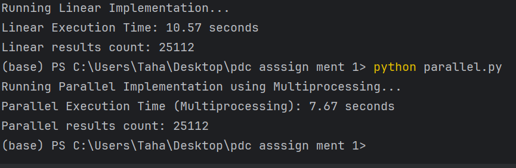

# Parallel and Distributed Computing Project

This project demonstrates the implementation of both linear and parallel algorithms for processing CSV data. It compares the performance of both methods and shows how parallel processing can be more efficient for larger datasets.

## Project Structure

- `linear.py`: The linear implementation of processing the CSV data.
- `parallel.py`: The parallel implementation using the `multiprocessing` library to process the CSV data in parallel.

## How to Run

1. Clone the repository:
    ```bash
    git clone https://github.com/Tahamallick/parallel-and-distributed-computing-Tier-1-.git
    cd parallel-and-distributed-computing-Tier-1-
    ```


3. To run the linear implementation:
    ```bash
    python linear.py
    ```

4. To run the parallel implementation:
    ```bash
    python parallel.py
    ```

## Output

### Linear Execution
- **Execution Time**: 10.57 seconds
- **Results Count**: 25112

### Parallel Execution using Multiprocessing
- **Execution Time**: 7.67 seconds
- **Results Count**: 25112

---

### Screenshot of the output:



## Conclusion

- The linear implementation takes 10.57 seconds, while the parallel implementation using multiprocessing reduces the execution time to 7.67 seconds for the same task.
- Both methods process the same number of results (25112), showing that parallel computing can be more efficient for larger datasets.

